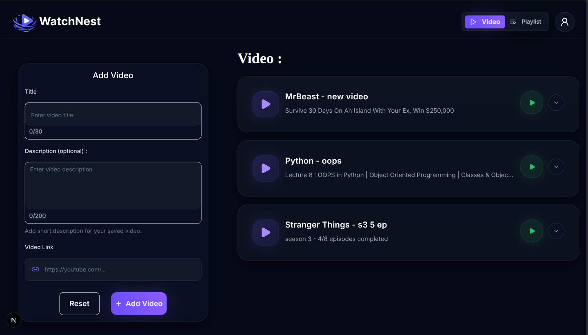

# 🎬 WatchNest

### Save it today. Watch it tomorrow.

WatchNest is a modern video bookmarking platform that helps you organize videos from YouTube and other platforms in one place. Instead of losing interesting videos in browser tabs, chat messages, or bookmarks, WatchNest lets you save, categorize, and share collections with anyone using a single link.

---

## Features

* 📌 Save videos from multiple platforms
* 📂 Organize videos into custom collections
* 🏷️ Add tags and descriptions
* 🔗 Share an entire collection with a single link
* 🔐 Secure authentication
* 🌙 Beautiful modern dark UI with glassmorphism

---

##  Problem It Solves

We often come across useful or entertaining videos but forget to watch them later. They end up scattered across browser tabs, bookmarks, WhatsApp chats, Discord, Telegram, or social media.

WatchNest solves this problem by providing one centralized place where you can:

* Save videos instantly
* Organize them into collections
* Never lose track of videos
* Share multiple videos with one link instead of sending them individually

---

## Preview

Take one look at WatchNest in action.

---

## 🛠️ Tech Stack

### Frontend

* React
* Next.js
* TypeScript
* Tailwind CSS
* shadcn/ui
* Lucide React

### Backend

* Node.js
* Express.js
* TypeScript
* NextAuth Authentication

### Database

* PostgreSQL
* Drizzle ORM

### DevOps & Tools

* Docker
* Docker Compose
* Git & GitHub

---

